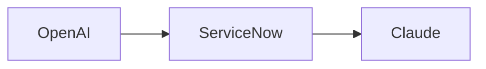

# Dig

Dig converts Mermaid flowcharts into editable ClickUp Whiteboard shapes. Its runtime is based directly on the supplied Splash installer, preserving Splash's parser, Dagre compound layout, draggable phase preview, locked-container re-layout, native tldraw injection, batching, bindings, clear-board option, and zoom-to-fit behavior. Dig adds its own name and a 50-app SaaS icon catalog.

## Formal workflow standard

Dig applies standard flowchart notation consistently across workflows:

- `START_` — green oval
- `TASK_`, `PROCESS_`, or `STEP_` — blue rectangle
- `DECISION_` or `DECIDE_` — orange diamond
- `END_` — red oval
- `-->` — directional arrow
- Yes/approved/success arrows — green
- No/rejected/failed arrows — red
- Other directional arrows — black

The Dig panel includes **Insert formal workflow template**, which creates a ready-to-edit two-phase example using these conventions. Mermaid decision braces such as `DECISION_READY{"Ready?"}` are also recognized automatically.

## Install

Dig is a static site. Host this folder on an HTTPS origin (GitHub Pages, Cloudflare Pages, Netlify, or an internal static host), then open `index.html` in the same browser and profile where you use ClickUp. Drag the **Dig** button to that browser's bookmarks bar.

The Codex in-app preview browser is separate from Chrome, Edge, Safari, and Firefox. A bookmark installed in one browser cannot run in a ClickUp tab in another browser.

If dragging does not preserve the bookmarklet, select **Copy bookmark code**, create or edit a bookmark in the ClickUp browser, and paste the copied code into its URL or Address field. If clicking Dig opens the installer page, delete that bookmark and reinstall it with this manual method.

Dig's installed bookmark contains the parser, overlay, preview, and Whiteboard injection code. Like Splash, it loads Dagre from cdnjs when you preview or inject a diagram. It fetches only the SaaS icons used in the current diagram from Iconify and falls back to a generated monogram if an icon cannot load.

Do not install from a `file://` URL. Browsers block HTTPS pages such as ClickUp from loading bookmarklet code from local files.

## Use

1. Open a ClickUp Whiteboard.
2. Click the Dig bookmark.
3. Paste Mermaid flowchart syntax.
4. Optionally select **Insert formal workflow template** to start with the standard notation.
5. Select **Chart Course & Arrange Phases**.
6. Drag the Intake phase—or any other top-level phase block—to the position you want.
7. Select **Dig into Whiteboard**. Dig re-lays out the nodes inside the moved containers, then uses the live ClickUp tldraw editor to create native assets, shapes, and bindings.

## Source workflows

- For long transcripts, place the text in a public ClickUp Doc before asking an agent to generate Mermaid.
- Gong links may not be readable outside Gong; copy the transcript into a ClickUp Doc first.
- A structured workflow summary usually produces cleaner Mermaid than a raw transcript.

## Supported Mermaid subset

- `flowchart` and `graph`
- `TB`, `TD`, `BT`, `LR`, and `RL`
- rectangle, rounded, stadium, circle, and decision nodes
- `subgraph` phase containers
- solid and dotted connectors, including labels
- `classDef`, `class`, and `:::class` color styling
- Splash node prefixes including `STEP_`, `AGENT_`, `INT_`, `DASH_`, `DECIDE_`, `NOTE_`, `DOC_`, and others
- 50 SaaS application icons using `:::icon_<slug>` or `:::icon-<slug>` classes

### SaaS icons

Add an icon class to a Mermaid node, for example:

The Dig panel includes a 50-app catalog and can insert a correctly formatted icon node. It also recognizes exact app names in node labels. Icons include OpenAI, Claude, ServiceNow, Salesforce, Slack, Microsoft Teams, Zoom, Google Workspace, AWS, Azure, GitHub, Jira, Notion, ClickUp, HubSpot, Workday, Stripe, Shopify, Figma, Canva, Miro, Zapier, Snowflake, Datadog, Cloudflare, Twilio, and other major SaaS applications.

Sequence, class, state, ER, Gantt, and mind-map diagrams are not currently supported.

## How ClickUp injection works

ClickUp does not publish a Whiteboard-shape creation API. Dig follows Splash's working approach: it locates the live tldraw editor attached to the active Whiteboard and calls its native `createAssets`, `createShapes`, and `createBindings` methods. This avoids the incompatible Excalidraw clipboard bridge. The integration still depends on undocumented ClickUp internals and may need maintenance when ClickUp changes Whiteboards.

This is an unofficial compatibility bridge and may require maintenance when ClickUp changes Whiteboard internals.

## Files

- `index.html` — bookmarklet install page and quick guide
- `splash-source.js` — the unmodified JavaScript extracted from the supplied Splash installer
- `build-bookmarklet.mjs` — applies the Dig name and icon extension to the Splash source
- `dig.js` — generated Dig runtime
- `dig-bookmarklet.js` — generated bookmarklet payload
- `tests/bookmarklet.test.js` — behavior, icon, and bookmark-size tests
