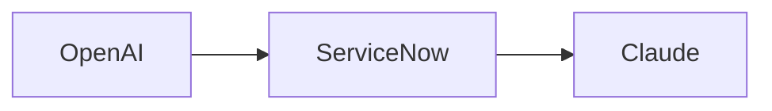

# Dig

Dig converts Mermaid flowcharts into editable ClickUp Whiteboard shapes. It supports steps, decisions, labeled connectors, class-based colors, phase containers (`subgraph`), compact layered auto-layout, and manual phase positioning before injection.

## Install

Dig is a static site. Host this folder on an HTTPS origin (GitHub Pages, Cloudflare Pages, Netlify, or an internal static host), then open `index.html` in the same browser and profile where you use ClickUp. Drag the **Dig** button to that browser's bookmarks bar.

The Codex in-app preview browser is separate from Chrome, Edge, Safari, and Firefox. A bookmark installed in one browser cannot run in a ClickUp tab in another browser.

If dragging does not preserve the bookmarklet, select **Copy bookmark code**, create or edit a bookmark in the ClickUp browser, and paste the copied code into its URL or Address field. If clicking Dig opens the installer page, delete that bookmark and reinstall it with this manual method.

Dig's installed bookmark is self-contained. It includes the parser, compact layout engine, and Whiteboard overlay instead of loading scripts from GitHub Pages or a CDN at runtime. This is required because ClickUp staging and production pages restrict external script origins. Keeping the bookmark small also avoids execution failures in managed browser profiles.

Do not install from a `file://` URL. Browsers block HTTPS pages such as ClickUp from loading bookmarklet code from local files.

## Use

1. Open a ClickUp Whiteboard.
2. Click the Dig bookmark.
3. Paste Mermaid flowchart syntax.
4. Select **Preview** (or press Cmd/Ctrl+Enter).
5. Drag phase headers if needed.
6. Select **Inject into Whiteboard**. Dig uses the live ClickUp tldraw editor to create native shapes and bindings, matching Splash's working injection method.

## Source workflows

- For long transcripts, place the text in a public ClickUp Doc before asking an agent to generate Mermaid.
- Gong links may not be readable outside Gong; copy the transcript into a ClickUp Doc first.
- A structured workflow summary usually produces cleaner Mermaid than a raw transcript.

## Supported Mermaid subset

- `flowchart` and `graph`
- `TB`, `TD`, `BT`, `LR`, and `RL`
- rectangle, rounded, stadium, circle, and decision nodes
- `subgraph` phase containers
- solid and dotted connectors, including labels
- `classDef`, `class`, and `:::class` color styling
- semantic classes containing `agent`, `integration`, or `dashboard`
- 50 SaaS application icons using `:::icon-<slug>` classes

### SaaS icons

Add an icon class to a Mermaid node, for example:

The Dig panel includes a searchable 50-app catalog and can insert a correctly formatted icon node. It also recognizes app names in node labels. Icons include OpenAI, Claude, ServiceNow, Salesforce, Slack, Microsoft Teams, Zoom, Google Workspace, AWS, Azure, GitHub, Jira, Notion, ClickUp, HubSpot, Workday, Stripe, Shopify, Figma, Canva, Miro, Zapier, Snowflake, Datadog, Cloudflare, Twilio, and other major SaaS applications. Dig fetches only the icons used in the current diagram and falls back to a branded monogram if an icon host is unavailable.

Sequence, class, state, ER, Gantt, and mind-map diagrams are not currently supported.

## How ClickUp injection works

ClickUp does not publish a Whiteboard-shape creation API. Dig follows Splash's working approach: it locates the live tldraw editor attached to the active Whiteboard and calls its native `createAssets`, `createShapes`, and `createBindings` methods. This avoids the incompatible Excalidraw clipboard bridge. The integration still depends on undocumented ClickUp internals and may need maintenance when ClickUp changes Whiteboards.

This is an unofficial compatibility bridge and may require maintenance when ClickUp changes Whiteboard internals.

## Files

- `index.html` — bookmarklet install page and quick guide
- `dig-bookmarklet.js` — generated self-contained bookmarklet payload
- `build-bookmarklet.mjs` — rebuilds the self-contained payload
- `dig.js` — ClickUp overlay, preview, phase dragging, and injection
- `dig-core.js` — Mermaid parsing, compact layered layout, and editable-shape serialization
- `tests/core.test.js` — parser and serialization smoke tests
